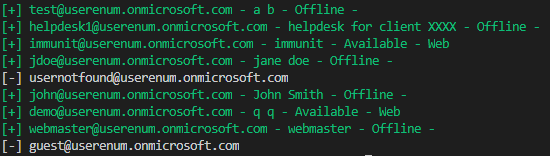
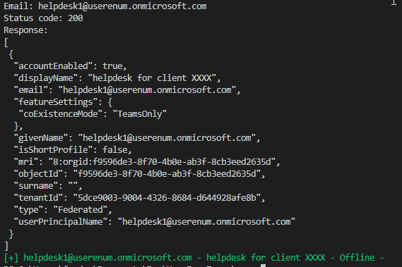

# UserEnumTeams

## Description

Sometimes user enumeration could be sometimes useful during the reconnaissance of an assessment. This tool will determine if an email is registered on teams or not. More details on the [immunIT's blog](https://www.immunit.ch/blog/2021/07/05/microsoft-teams-user-enumeration/)

## Usage

```
> .\UserEnumTeams userenum --help
Users can be enumerated on Microsoft Teams with the search features.
This tool validates an email address or a list of email addresses.
If these emails exist the presence of the user is retrieved as well as the device used to connect

Usage:
  UserEnumTeams userenum [flags]

Flags:
  -e, --email string   Email address
  -f, --file string    File containing the email address
  -h, --help           help for userenum
  -t, --token string   Bearer token (only the base64 part: eyJ0...)

Global Flags:
  -v, --verbose   Verbose
```

```
.\UserEnumTeams userenum -u emails.txt -t eyJ0eXAiOiJKV1QiLCJub25jZSI6IlpNc3FVTnJDeUJaYTBJZ3RXSmFsNUZWVjRU……vKiXYtCir3GJ9rMPAhPXiXSzSMeOPiSaM7SDoCg
```



```
.\UserEnumTeams userenum -u emails.txt -t eyJ0eXAiOiJKV1QiLCJub25jZSI6IlpNc3FVTnJDeUJaYTBJZ3RXSmFsNUZWVjRU……vKiXYtCir3GJ9rMPAhPXiXSzSMeOPiSaM7SDoCg -v
```


